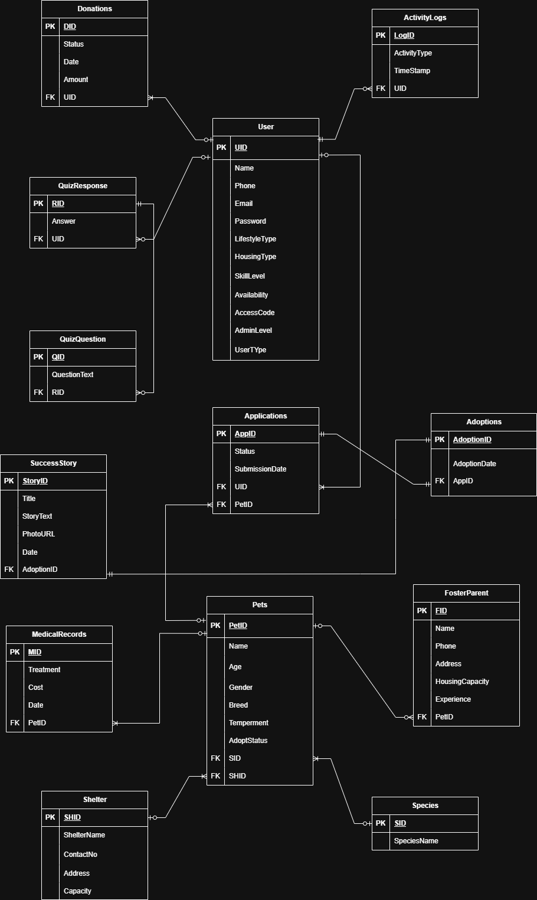

# Pet Adoption Management System

A full-stack **Pet Adoption Management System** developed for the **CSE370 Database Management System** course project.  
The platform is designed to simplify and organize the pet adoption process by connecting **animal shelters**, **administrators**, **volunteers**, and **adopters** through a centralized database-driven web application.

---

## Project Overview

Pet adoption often involves scattered records, manual tracking, and inefficient communication between shelters and adopters. This system provides a structured digital solution where users can browse pets, view medical history, submit adoption applications, and manage adoption-related data through a clean and organized interface.

This project focuses on:
- designing a proper relational database
- implementing normalized schema
- building a working full-stack system
- demonstrating real CRUD-based features for core modules

---

## Main Features

### User Side
- Browse available pets
- View detailed pet profiles
- View pet medical history
- Submit adoption applications
- Explore success stories
- Take a pet suggestion quiz
- Create user account and login

### Admin Side
- Manage pet records
- Manage shelters
- Manage foster parents
- Review and manage applications
- Manage medical records
- Track donations
- View activity logs

---

## Core Modules

- **Users**
- **Shelters**
- **Foster Parents**
- **Pets**
- **Medical Records**
- **Applications**
- **Adoptions**
- **Success Stories**
- **Donations**
- **Quiz Questions & Responses**
- **Activity Logs**

---

## User Roles

The system supports multiple roles with different responsibilities:

- **Adopter**  
  Can browse pets, apply for adoption, view medical records, explore success stories, and use the pet suggestion quiz.

- **Volunteer**  
  Can support shelter operations and assist in adoption-related activities.

- **Administrator**  
  Has full access to manage pets, shelters, foster parents, medical records, applications, donations, and logs.

---

## Database Design

This project was built with strong emphasis on database design and normalization.

### ER Diagram


Editable version:  
[Open Draw.io File](docs/diagrams/er-diagram.drawio)

### Schema Diagram


### Normalized Schema Diagram


---

## Tech Stack

### Frontend
- **React**
- **Tailwind CSS**
- **Vite**

### Backend
- **Laravel**
- **PHP**

### Database
- **MySQL**

### Design & Documentation
- **Draw.io**

---

## Project Structure

```bash
pet-adoption-management-system/
│
├── backend/      # Laravel backend
├── frontend/     # React + Tailwind frontend
├── docs/         # Diagrams, documentation, and report files
└── README.md