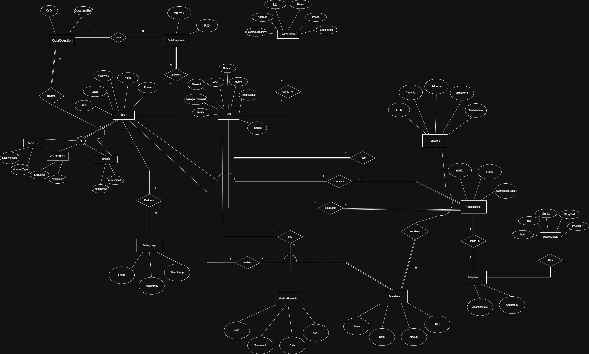
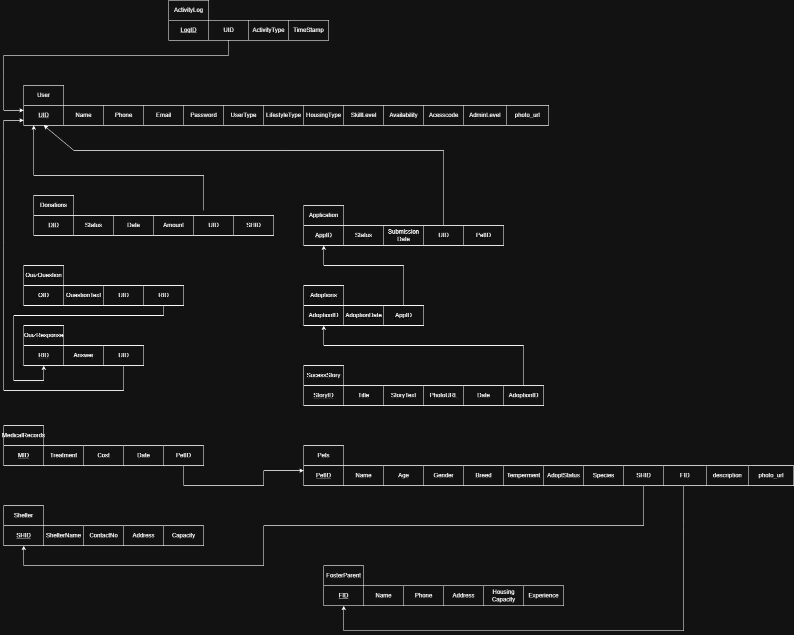

<div align="center">

# 🐾 Pet Adoption Management System

### CSE370 Database Management System Course Project

A full-stack web application designed to make pet adoption easier by connecting **pets**, **shelters**, **adopters**, **volunteers**, and **administrators** through a database-driven platform.


</div>

---

## 📌 Overview

The **Pet Adoption Management System** is a full-stack web application built for managing pet adoption activities. It helps users browse pets, submit adoption applications, view medical records, and explore success stories. Admins can manage pets, shelters, applications, donations, and activity logs.

---

## Report

[View Project Report](https://github.com/sakibhossain0/pet-adoption-management-system/raw/main/docs/reports/CSE370_Lab_ProjectReport_Template.pdf)

## ✨ Features

### User Features

- Browse and search pets
- View pet profiles and medical history
- Submit adoption applications
- Read adoption success stories
- Take a pet recommendation quiz

### Admin Features

- Manage pets, shelters, and foster parents
- Review adoption applications
- Manage medical records
- Track donations
- Monitor activity logs

---

## 👥 User Roles

- **Adopter**: Browses pets and applies for adoption
- **Volunteer**: Supports shelter and adoption activities
- **Administrator**: Manages the entire system

---

## 🧩 Core Modules

- Users
- Shelters
- Foster Parents
- Pets
- Medical Records
- Applications
- Adoptions
- Donations
- Success Stories
- Quiz Responses
- Activity Logs

---

## 🗄️ Database Design

This project focuses on:

- ER modeling
- Relational schema design
- Normalization
- Primary and foreign key relationships
- CRUD operations

### ER Diagram



### Schema Diagram



### NORMALIZED Schema Diagram


---

## 🏗️ Tech Stack

### Frontend

- React
- Tailwind CSS
- Vite
- JavaScript

### Backend

- Laravel
- PHP

### Database

- MySQL

### Tools

- Git
- GitHub
- Draw.io
- XAMPP

---

## 📁 Project Structure

```bash
pet-adoption-management-system/
│
├── backend/
├── frontend/
├── docs/
└── README.md